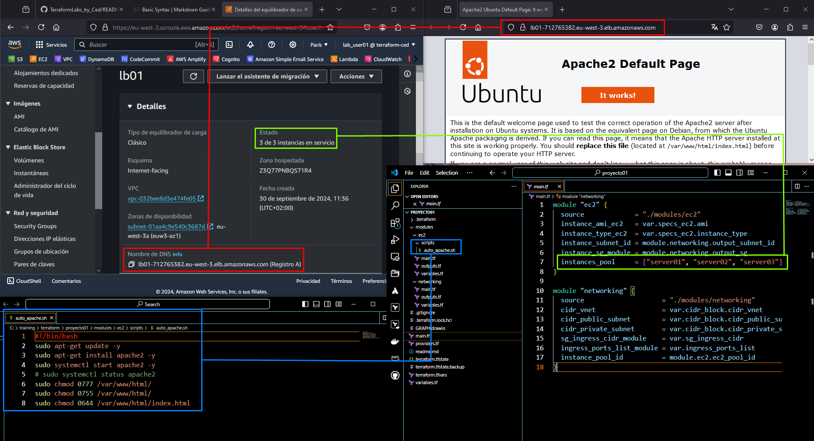

<h1>Proyecto 01</h1>
<h2>Pool de instancias EC2 detrás de un LB expuesto a internet.</h2>

Este proyecto crea un pool de instancias EC2 configuradas con Apache mediante un pequeño archivo bash que sirve para comprobar que el LB funciona correctamente.

Disponemos de dos módulos, el de EC2 y el networking. 

Cada uno de estos módulos genera outputs que sirven para facilitar información al otro módulo.

Podemos modificar el nº del pool de instancias en la propia llamada del modulo "ec2" así como las specs de las máquinas.

Es un proyecto sencillo, que expone un balanceador de carga al exterior con una dirección DNS pública y la cual va resolviendo las peticiones de los clientes a las instancias en función de las opciones configuradas de tráfico en el LB.

